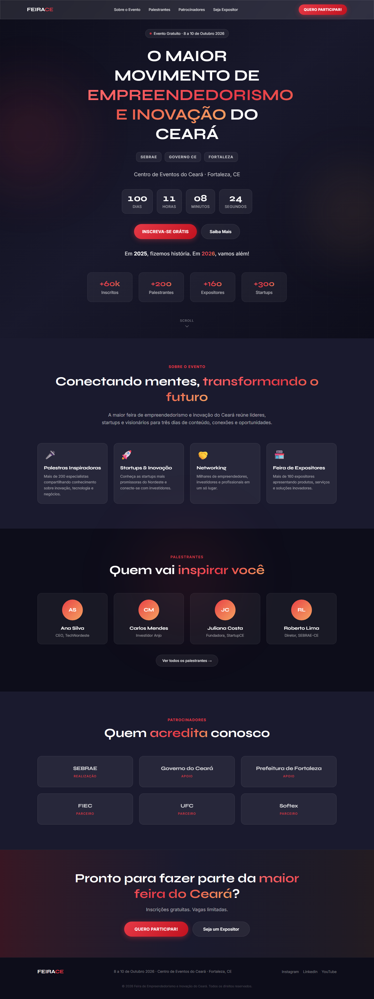
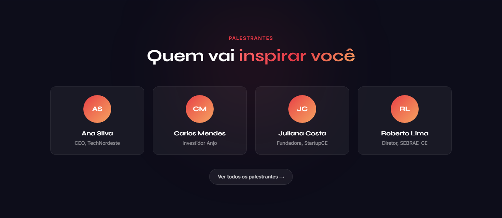
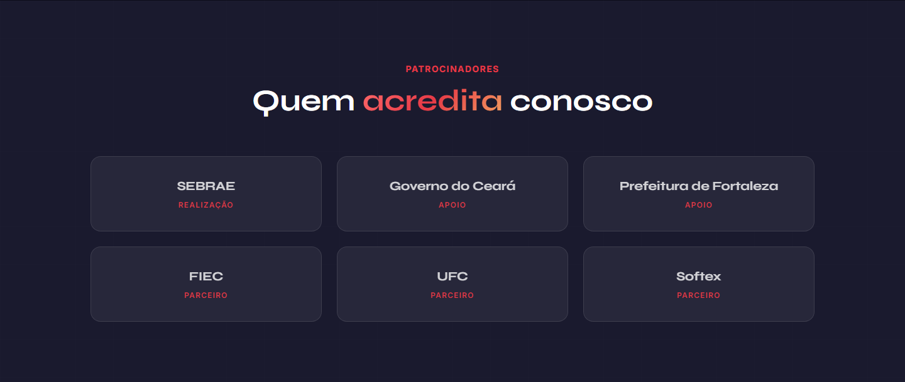
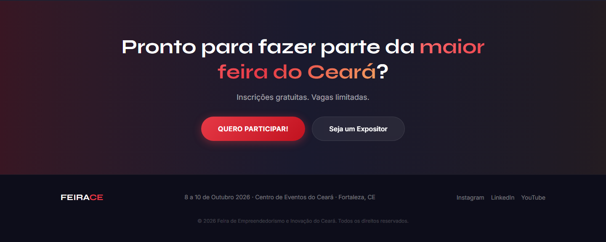
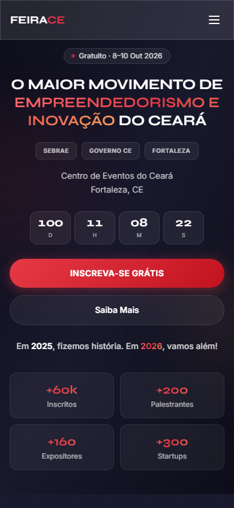

# FEIRACE — Site da Feira de Empreendedorismo e Inovação

Landing page do maior evento de empreendedorismo e inovação do Ceará. Desenvolvida com React, TypeScript e Tailwind CSS v4.

---

## Preview

### Desktop

#### Hero


#### Página completa


#### Sobre o Evento


#### Palestrantes


#### Patrocinadores


#### Footer / CTA


---

### Mobile

#### Hero


#### Página completa


---

## Funcionalidades

- **Hero** com contador regressivo ao vivo, estatísticas e CTAs
- **Navbar** fixa com menu hambúrguer no mobile
- **Seções:** Sobre, Palestrantes, Patrocinadores e Footer com CTA
- **Design responsivo** para desktop e celular
- **Visual moderno** com glass morphism, gradientes e animações sutis

---

## Tecnologias

| Tecnologia | Uso |
|---|---|
| [React 19](https://react.dev/) | Interface |
| [TypeScript](https://www.typescriptlang.org/) | Tipagem |
| [Vite 7](https://vite.dev/) | Build e dev server |
| [Tailwind CSS v4](https://tailwindcss.com/) | Estilização |
| [Syne](https://fonts.google.com/specimen/Syne) + [Inter](https://fonts.google.com/specimen/Inter) | Tipografia |

---

## Como rodar

### Pré-requisitos

- Node.js 18+
- npm

### Instalação

```bash
git clone <url-do-repositorio>
cd site-feira
npm install
```

### Desenvolvimento

```bash
npm run dev
```

Acesse `http://localhost:5173` (ou a porta indicada no terminal).

### Build de produção

```bash
npm run build
npm run preview
```

---

## Estrutura do projeto

```
site-feira/
├── docs/
│   └── screenshots/       # Prints do projeto
├── public/                # Assets estáticos (background.jpg, logos...)
├── scripts/
│   └── capture-screenshots.mjs
├── src/
│   ├── components/
│   │   ├── hero.tsx       # Seção principal
│   │   ├── Navbar.tsx     # Navegação
│   │   ├── Countdown.tsx  # Contador regressivo
│   │   ├── About.tsx      # Sobre o evento
│   │   ├── Speakers.tsx   # Palestrantes
│   │   ├── Sponsors.tsx   # Patrocinadores
│   │   └── Footer.tsx     # Rodapé e CTA
│   ├── App.tsx
│   ├── index.css          # Estilos globais e tema
│   └── main.tsx
└── index.html
```

---

## Assets opcionais

Coloque na pasta `public/` para personalizar o visual:

| Arquivo | Descrição |
|---|---|
| `background.jpg` | Imagem de fundo do hero |
| `logo1.png`, `logo2.png`, `logo3.png` | Logos dos parceiros |

---

## Atualizar screenshots

Com o servidor de desenvolvimento rodando:

```bash
node scripts/capture-screenshots.mjs
```

Para usar outra URL:

```bash
BASE_URL=http://localhost:5175 node scripts/capture-screenshots.mjs
```

---

